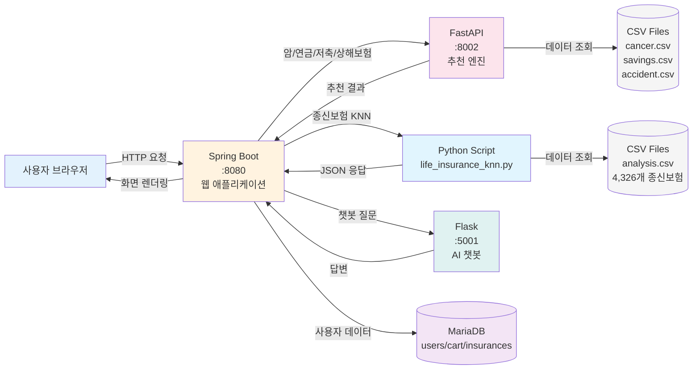
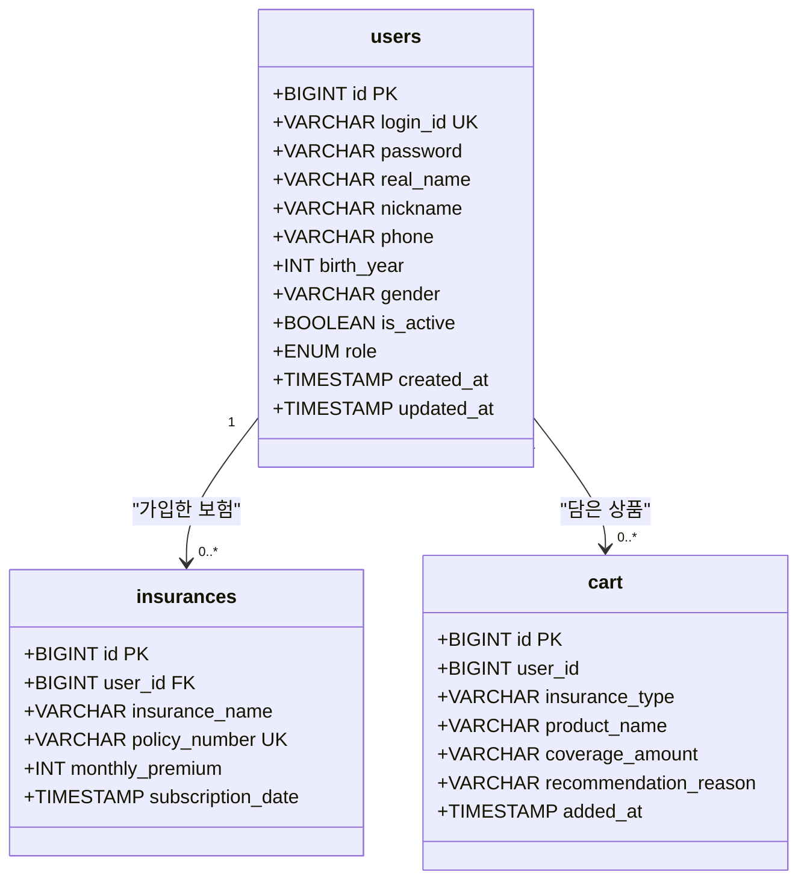

# 보험 상품 추천 플랫폼

AI 기반 맞춤형 보험 상품 추천 및 관리 시스템

---

## 목차

- [프로젝트 소개](#프로젝트-소개)
- [주요 기능](#주요-기능)
- [시스템 아키텍처](#시스템-아키텍처)
- [기술 스택](#기술-스택)
- [API 명세서](#api-명세서)
- [데이터베이스](#데이터베이스)
- [설치 및 실행](#설치-및-실행)
- [프로젝트 구조](#프로젝트-구조)

---

## 프로젝트 소개

사용자의 나이, 성별, 건강 상태, 직업 등 프로필 정보를 기반으로 최적의 보험 상품을 추천하는 플랫폼입니다.
마이크로서비스 아키텍처로 설계되어 3개의 독립적인 서버가 협업합니다.

### 핵심 가치

- **AI 기반 개인화**: KNN, 딥러닝 등 머신러닝 알고리즘 활용
- **효율성 우선**: 보험료 대비 보장 금액이 높은 상품 우선 노출
- **실시간 분석**: 1,000개 이상 보험 상품 데이터 실시간 필터링
- **지능형 챗봇**: 자연어 처리 기반 보험 용어 설명 및 상담

### 데이터 규모

| 항목 | 규모 |
|------|------|
| **보험 상품** | 5,000개 이상 (암보험, 상해보험, 저축성보험, 연금보험, 종신보험) |
| **암보험** | 96개 상품 |
| **상해보험** | 46개 상품 |
| **저축성보험** | 732개 상품 |
| **종신보험** | 4,326개 상품 (KNN 알고리즘) |
| **챗봇 학습 데이터** | 100개 이상 보험 용어 |

---

## 주요 기능

### 1. 보험 상품 추천 시스템

#### 1-1. 필터 기반 추천 (암보험, 상해보험, 저축성보험, 연금보험)

사용자가 직접 설정한 조건에 따라 보험 상품을 필터링하고 추천합니다.

**주요 필터 조건:**
- 보장금액: 최소/최대 보장금액 설정
- 보험료: 월 납입 보험료 범위 지정
- 갱신주기: 갱신형, 비갱신형, 종신형 선택
- 보험기간: 10년, 20년, 종신 등 기간 설정
- 가입연령: 최소/최대 가입 가능 연령
- 보험회사: 특정 보험사 선택/제외

**추천 알고리즘:**
```
최종점수 = (보장금액 점수 × 0.5) + (가성비 점수 × 0.3) + (안정성 점수 × 0.2)
```

- 보장금액 점수: 일반암 진단비 기준, 높을수록 높은 점수
- 가성비 점수: 보장금액 ÷ 월 보험료
- 안정성 점수: 해약환급금, 갱신주기 고려

#### 1-2. 프로필 기반 추천 (암보험)

사용자의 개인 정보를 분석하여 최적의 상품을 자동으로 추천합니다.

**분석 항목:**
- 나이: 연령대별 위험도 분석
- 성별: 성별 특화 보장 내용 고려
- 직업: 직업군별 위험도 평가
- 흡연 여부: 보험료 차등 적용
- 건강 상태: 기저질환 여부 반영
- 소득 수준: 납입 가능 보험료 산정

**추천 프로세스:**
1. 사용자 프로필 데이터 수집
2. FastAPI 추천 엔진으로 전송
3. AI 알고리즘 기반 상품 매칭
4. 상위 N개 상품 추천 및 이유 제시

#### 1-3. KNN 기반 추천 (종신보험)

**K-Nearest Neighbors 알고리즘 사용**

사용자가 원하는 조건과 가장 유사한 보험 상품을 찾아 추천합니다.

**특징:**
- 5차원 특징 벡터: [보험료, 지급금액, 나이, 직업, 직업위험도]
- 성별별 모델 분리: 남성/여성 각각 최적화된 추천
- StandardScaler: 공정한 거리 측정을 위한 정규화
- 3가지 정렬 옵션:
  - `distance`: 종합 유사도 기준
  - `premium`: 보험료 근접도 기준
  - `coverage`: 보장금액 근접도 기준

**알고리즘 흐름:**
```
1. 사용자 입력 (성별, 나이, 직업, 희망 보험료, 희망 보장금액)
   ↓
2. LabelEncoder로 직업/위험도 수치화
   ↓
3. StandardScaler로 특징 벡터 정규화
   ↓
4. 성별에 따라 KNN 모델 선택 (남성/여성)
   ↓
5. 유클리디안 거리 계산
   ↓
6. 희망 보험료 이하 상품만 필터링
   ↓
7. 상위 K개 상품 반환
```

**기술 스택:**
- scikit-learn: KNN, StandardScaler, LabelEncoder
- pandas: 데이터 처리
- numpy: 수치 계산

### 2. 관심 상품 관리 (장바구니)

#### 2-1. 상품 저장 및 비교

- 즉시 저장: 추천받은 상품을 클릭 한 번으로 장바구니 저장
- 상세 정보 유지: 보장 내용, 보험료, 추천 이유 함께 저장
- 비교 기능: 여러 상품의 보장 내용 및 보험료 한눈에 비교
- 중복 체크: 같은 상품 중복 저장 방지

#### 2-2. 데이터 관리

- 사용자별 독립 저장: 로그인 사용자별 장바구니 분리 관리
- 무제한 저장: 저장 개수 제한 없음
- 타임스탬프: 저장 날짜/시간 기록
- 일괄 삭제: 선택 삭제 또는 전체 삭제 가능

### 3. AI 챗봇 서비스

#### 3-1. 보험 용어 설명 (딥러닝)

**기술:**
- Sentence Transformers: 한국어 임베딩 모델 (`jhgan/ko-sroberta-multitask`)
- Cosine Similarity: 의미 유사도 계산
- 임계값 기반 응답: 0.6 이상일 때만 답변

**지원 용어 (100개+):**
- 전문 용어: 피보험자, 보험수익자, 해약환급금 등
- 보장 용어: 일반암, 유사암, 소액암, 후유장해 등
- 계약 용어: 갱신, 만기, 납입면제, 자동갱신 등

**추천 로직:**
```
질문 임베딩 생성 → (용어 유사도 × 0.8) + (설명 유사도 × 0.2) → 최적 답변 반환
```

#### 3-2. 상담 서비스

- 24시간 자동 응답: 언제든지 질문 가능
- 의미 기반 검색: 정확한 키워드 불필요
- 유사도 점수 제공: 답변 신뢰도 표시

### 4. 사용자 관리

#### 4-1. 회원 기능

- 회원가입/로그인: 일반 회원가입 및 로그인
- 소셜 로그인: 카카오 OAuth 2.0 연동
- 프로필 관리: 개인 정보 수정 및 관리
- 비밀번호 암호화: BCrypt 기반 안전한 저장

#### 4-2. 마이페이지

- 장바구니 조회: 저장한 보험 상품 목록
- 가입 보험 조회: 실제 가입한 보험 목록 (향후 기능)
- 프로필 정보 수정: 개인정보 업데이트

### 5. 관리자 기능

#### 5-1. 사용자 관리

- 권한 변경: USER ↔ ADMIN 권한 변경
- 계정 상태 관리: 활성화/비활성화 전환
- 사용자 목록 조회: 전체 회원 목록 및 상세 정보
- 계정 삭제: 영구 삭제 (복구 불가)

#### 5-2. 상품 관리

- 상품 등록: 새로운 보험 상품 DB 등록
- 상품 수정: 기존 상품 정보 업데이트
- 상품 삭제: 판매 중단 상품 제거
- 상품 통계: 조회수, 장바구니 추가 횟수 등

---

## 시스템 아키텍처

### 전체 구조



### 서버 역할

| 서버 | 포트 | 역할 | 기술 스택 |
|------|------|------|-----------|
| **Spring Boot** | 8080 | 웹 애플리케이션, 사용자 관리, 인증 | Java 17, Spring Boot 3.x, JPA, MariaDB |
| **FastAPI** | 8002 | 암/연금/저축/상해보험 추천 엔진 | Python 3.13, FastAPI, Pandas, NumPy |
| **Python Script** | - | 종신보험 KNN 추천 (ProcessBuilder) | Python 3.x, scikit-learn, KNN |
| **Flask** | 5001 | AI 챗봇, 자연어 처리 | Python 3.x, Flask, Sentence Transformers |

### 추천 엔진 구조

```
app/
├── main.py                  FastAPI 메인 서버
├── cancer_engine.py         암보험 추천 (필터 + 프로필)
├── pension_engine.py        연금보험 추천
├── savings_engine.py        저축성보험 추천
├── basic_engine.py          상해보험 추천
├── life_insurance_knn.py    종신보험 KNN 추천 ★ AI
└── data_loader.py           CSV 데이터 로더
```

---

## 기술 스택

### Backend

<table>
<tr>
<td width="33%" valign="top">

**Spring Boot**
- Java 17
- Spring Boot 3.x
- Spring Security
- Spring Data JPA
- Mustache 템플릿
- OAuth 2.0 (카카오)

</td>
<td width="33%" valign="top">

**FastAPI**
- Python 3.13
- FastAPI
- Pandas
- NumPy
- Uvicorn

</td>
<td width="33%" valign="top">

**Flask + AI**
- Python 3.x
- Flask
- Sentence Transformers
- scikit-learn (KNN)
- 자연어 처리

</td>
</tr>
</table>

### Machine Learning

| 알고리즘 | 용도 | 파일 |
|----------|------|------|
| **K-Nearest Neighbors** | 종신보험 유사 상품 추천 | `life_insurance_knn.py` |
| **Sentence Transformers** | 챗봇 의미 분석 | Flask `main.py` |
| **Cosine Similarity** | 질문-답변 유사도 계산 | Flask `main.py` |
| **StandardScaler** | 특징 정규화 | `life_insurance_knn.py` |
| **LabelEncoder** | 범주형 데이터 인코딩 | `life_insurance_knn.py` |

### Database

- **MariaDB**: 사용자, 장바구니, 가입 보험 데이터 (관계형 DB)
- **CSV Files**: 보험 상품 데이터 (5,000개 이상)

---

## API 명세서

### Spring Boot API (Port 8080)

<table>
<thead>
<tr>
<th width="15%">기능</th>
<th width="10%">메소드</th>
<th width="35%">엔드포인트</th>
<th width="30%">설명</th>
<th width="10%">인증</th>
</tr>
</thead>
<tbody>
<tr style="background-color: #fce4ec;">
<td colspan="5"><strong>보험 추천</strong></td>
</tr>
<tr>
<td>암보험 (필터)</td>
<td><code>POST</code></td>
<td><code>/cancer/recommend/api</code></td>
<td>필터 기반 암보험 추천</td>
<td>없음</td>
</tr>
<tr>
<td>암보험 (프로필)</td>
<td><code>POST</code></td>
<td><code>/cancer/profile-recommend/api</code></td>
<td>프로필 기반 암보험 추천</td>
<td>없음</td>
</tr>
<tr>
<td>상해보험</td>
<td><code>POST</code></td>
<td><code>/accident/recommend/api</code></td>
<td>상해보험 추천</td>
<td>없음</td>
</tr>
<tr>
<td>저축성보험</td>
<td><code>POST</code></td>
<td><code>/savings-insurance/recommend/api</code></td>
<td>저축성보험 추천</td>
<td>없음</td>
</tr>
<tr>
<td>연금보험</td>
<td><code>POST</code></td>
<td><code>/savings/recommend/api</code></td>
<td>연금보험 추천</td>
<td>없음</td>
</tr>
<tr>
<td>종신보험 (KNN)</td>
<td><code>POST</code></td>
<td><code>/life/recommend</code></td>
<td>종신보험 KNN 추천</td>
<td>없음</td>
</tr>
<tr style="background-color: #e8f5e9;">
<td colspan="5"><strong>장바구니</strong></td>
</tr>
<tr>
<td>상품 추가</td>
<td><code>POST</code></td>
<td><code>/cart/add</code></td>
<td>관심 상품 추가</td>
<td><strong>필수</strong></td>
</tr>
<tr>
<td>상품 삭제</td>
<td><code>DELETE</code></td>
<td><code>/cart/{cartId}</code></td>
<td>관심 상품 삭제</td>
<td><strong>필수</strong></td>
</tr>
<tr>
<td>전체 삭제</td>
<td><code>DELETE</code></td>
<td><code>/cart/clear</code></td>
<td>관심 상품 전체 삭제</td>
<td><strong>필수</strong></td>
</tr>
<tr>
<td>개수 조회</td>
<td><code>GET</code></td>
<td><code>/cart/count</code></td>
<td>관심 상품 개수 조회</td>
<td><strong>필수</strong></td>
</tr>
<tr style="background-color: #fff3e0;">
<td colspan="5"><strong>관리자</strong></td>
</tr>
<tr>
<td>권한 변경</td>
<td><code>POST</code></td>
<td><code>/admin/users/{userId}/role</code></td>
<td>사용자 권한 변경</td>
<td><strong>ADMIN</strong></td>
</tr>
<tr>
<td>비활성화</td>
<td><code>POST</code></td>
<td><code>/admin/users/{userId}/withdraw</code></td>
<td>사용자 비활성화</td>
<td><strong>ADMIN</strong></td>
</tr>
<tr>
<td>활성화</td>
<td><code>POST</code></td>
<td><code>/admin/users/{userId}/restore</code></td>
<td>사용자 활성화</td>
<td><strong>ADMIN</strong></td>
</tr>
<tr>
<td>사용자 삭제</td>
<td><code>DELETE</code></td>
<td><code>/admin/users/{userId}</code></td>
<td>사용자 영구 삭제</td>
<td><strong>ADMIN</strong></td>
</tr>
<tr>
<td>상품 삭제</td>
<td><code>DELETE</code></td>
<td><code>/admin/products/{productId}</code></td>
<td>보험 상품 삭제</td>
<td><strong>ADMIN</strong></td>
</tr>
<tr style="background-color: #f3e5f5;">
<td colspan="5"><strong>유틸리티</strong></td>
</tr>
<tr>
<td>보험료 계산</td>
<td><code>POST</code></td>
<td><code>/api/calculate</code></td>
<td>보험료 계산</td>
<td>없음</td>
</tr>
<tr>
<td>챗봇 문의</td>
<td><code>POST</code></td>
<td><code>/chatbot/ask</code></td>
<td>챗봇 문의 (Flask 연동)</td>
<td>없음</td>
</tr>
</tbody>
</table>

---

### FastAPI 추천 엔진 (Port 8002)

<table>
<thead>
<tr>
<th width="15%">기능</th>
<th width="10%">메소드</th>
<th width="35%">엔드포인트</th>
<th width="30%">설명</th>
<th width="10%">관련 엔진</th>
</tr>
</thead>
<tbody>
<tr style="background-color: #fce4ec;">
<td colspan="5"><strong>암보험</strong></td>
</tr>
<tr>
<td>필터 추천</td>
<td><code>POST</code></td>
<td><code>/recommend</code></td>
<td>필터 기반 암보험 추천</td>
<td><code>cancer_engine.py</code></td>
</tr>
<tr>
<td>프로필 추천</td>
<td><code>POST</code></td>
<td><code>/recommend/user-profile</code></td>
<td>사용자 프로필 기반 추천</td>
<td><code>cancer_engine.py</code></td>
</tr>
<tr>
<td>통계 조회</td>
<td><code>GET</code></td>
<td><code>/analytics/summary</code></td>
<td>암보험 상품 통계 조회</td>
<td><code>data_loader.py</code></td>
</tr>
<tr style="background-color: #e1f5fe;">
<td colspan="5"><strong>연금보험</strong></td>
</tr>
<tr>
<td>상품 추천</td>
<td><code>POST</code></td>
<td><code>/savings/recommend</code></td>
<td>연금보험 상품 추천</td>
<td><code>pension_engine.py</code></td>
</tr>
<tr>
<td>통계 조회</td>
<td><code>GET</code></td>
<td><code>/savings/analytics</code></td>
<td>연금보험 상품 통계 조회</td>
<td><code>pension_engine.py</code></td>
</tr>
<tr style="background-color: #fff3e0;">
<td colspan="5"><strong>저축성보험</strong></td>
</tr>
<tr>
<td>상품 추천</td>
<td><code>POST</code></td>
<td><code>/recommend/savings-insurance</code></td>
<td>저축성보험 상품 추천</td>
<td><code>savings_engine.py</code></td>
</tr>
<tr>
<td>통계 조회</td>
<td><code>GET</code></td>
<td><code>/savings-insurance/analytics</code></td>
<td>저축성보험 상품 통계 조회</td>
<td><code>savings_engine.py</code></td>
</tr>
<tr style="background-color: #e8f5e9;">
<td colspan="5"><strong>상해보험</strong></td>
</tr>
<tr>
<td>상품 추천</td>
<td><code>POST</code></td>
<td><code>/recommend/accident</code></td>
<td>상해보험 상품 추천</td>
<td><code>basic_engine.py</code></td>
</tr>
<tr style="background-color: #f3e5f5;">
<td colspan="5"><strong>시스템</strong></td>
</tr>
<tr>
<td>데이터 리로드</td>
<td><code>POST</code></td>
<td><code>/admin/reload-data</code></td>
<td>데이터 및 추천 엔진 리로드</td>
<td><code>main.py</code></td>
</tr>
<tr>
<td>헬스 체크</td>
<td><code>GET</code></td>
<td><code>/health</code></td>
<td>API 서버 상태 확인</td>
<td><code>main.py</code></td>
</tr>
</tbody>
</table>

---

### Flask AI 챗봇 (Port 5001)

<table>
<thead>
<tr>
<th width="15%">기능</th>
<th width="10%">메소드</th>
<th width="35%">엔드포인트</th>
<th width="30%">설명</th>
<th width="10%">AI 기술</th>
</tr>
</thead>
<tbody>
<tr style="background-color: #e0f2f1;">
<td colspan="5"><strong>챗봇</strong></td>
</tr>
<tr>
<td>질의응답</td>
<td><code>POST</code></td>
<td><code>/chat</code></td>
<td>보험 용어 설명 (딥러닝)</td>
<td>Sentence Transformers</td>
</tr>
</tbody>
</table>

---

## 데이터베이스

### 스키마 다이어그램



### 테이블 설명

<table>
<tr>
<td width="50%" valign="top">

#### **users** - 사용자

<table>
<thead>
<tr>
<th align="left">컬럼명</th>
<th align="left">타입</th>
<th align="left">제약조건</th>
<th align="left">설명</th>
</tr>
</thead>
<tbody>
<tr style="background-color: #f0f8ff;">
<td colspan="4"><strong>핵심 컬럼</strong></td>
</tr>
<tr>
<td><code>id</code></td>
<td>BIGINT</td>
<td><strong>PK</strong></td>
<td>사용자 ID</td>
</tr>
<tr>
<td><code>login_id</code></td>
<td>VARCHAR</td>
<td><strong>UNIQUE</strong></td>
<td>로그인 아이디</td>
</tr>
<tr>
<td><code>password</code></td>
<td>VARCHAR</td>
<td>NOT NULL</td>
<td>비밀번호 (BCrypt)</td>
</tr>
<tr>
<td><code>real_name</code></td>
<td>VARCHAR</td>
<td>NOT NULL</td>
<td>실명</td>
</tr>
<tr style="background-color: #f0f8ff;">
<td colspan="4"><strong>프로필</strong></td>
</tr>
<tr>
<td><code>nickname</code></td>
<td>VARCHAR</td>
<td>NULL</td>
<td>닉네임</td>
</tr>
<tr>
<td><code>phone</code></td>
<td>VARCHAR</td>
<td>NULL</td>
<td>전화번호</td>
</tr>
<tr>
<td><code>birth_year</code></td>
<td>INT</td>
<td>NULL</td>
<td>생년</td>
</tr>
<tr>
<td><code>gender</code></td>
<td>VARCHAR</td>
<td>NULL</td>
<td>성별</td>
</tr>
<tr style="background-color: #f0f8ff;">
<td colspan="4"><strong>시스템</strong></td>
</tr>
<tr>
<td><code>is_active</code></td>
<td>BOOLEAN</td>
<td>DEFAULT TRUE</td>
<td>활성화 여부</td>
</tr>
<tr>
<td><code>role</code></td>
<td>ENUM</td>
<td>DEFAULT USER</td>
<td>권한 (USER/ADMIN)</td>
</tr>
<tr>
<td><code>created_at</code></td>
<td>TIMESTAMP</td>
<td>NOT NULL</td>
<td>생성일시</td>
</tr>
<tr>
<td><code>updated_at</code></td>
<td>TIMESTAMP</td>
<td>NOT NULL</td>
<td>수정일시</td>
</tr>
</tbody>
</table>

**관계**: insurances (1:N), cart (1:N)  
**인덱스**: PK(id), UNIQUE(login_id)

</td>
<td width="50%" valign="top">

#### **insurances** - 가입 보험

<table>
<thead>
<tr>
<th align="left">컬럼명</th>
<th align="left">타입</th>
<th align="left">제약조건</th>
<th align="left">설명</th>
</tr>
</thead>
<tbody>
<tr>
<td><code>id</code></td>
<td>BIGINT</td>
<td><strong>PK</strong></td>
<td>보험 ID</td>
</tr>
<tr>
<td><code>user_id</code></td>
<td>BIGINT</td>
<td><strong>FK</strong> → users</td>
<td>사용자 ID</td>
</tr>
<tr>
<td><code>insurance_name</code></td>
<td>VARCHAR</td>
<td>NOT NULL</td>
<td>보험 상품명</td>
</tr>
<tr>
<td><code>policy_number</code></td>
<td>VARCHAR</td>
<td><strong>UNIQUE</strong></td>
<td>증권번호</td>
</tr>
<tr>
<td><code>coverage_period</code></td>
<td>VARCHAR</td>
<td>NOT NULL</td>
<td>보장기간</td>
</tr>
<tr>
<td><code>monthly_premium</code></td>
<td>INT</td>
<td>NOT NULL</td>
<td>월 납입액</td>
</tr>
<tr>
<td><code>subscription_date</code></td>
<td>TIMESTAMP</td>
<td>NOT NULL</td>
<td>가입일</td>
</tr>
</tbody>
</table>

**관계**: ManyToOne → users.id  
**인덱스**: PK(id), UNIQUE(policy_number), FK(user_id)

<br>

#### **cart** - 장바구니

<table>
<thead>
<tr>
<th align="left">컬럼명</th>
<th align="left">타입</th>
<th align="left">제약조건</th>
<th align="left">설명</th>
</tr>
</thead>
<tbody>
<tr>
<td><code>id</code></td>
<td>BIGINT</td>
<td><strong>PK</strong></td>
<td>장바구니 ID</td>
</tr>
<tr>
<td><code>user_id</code></td>
<td>BIGINT</td>
<td>NOT NULL</td>
<td>사용자 ID</td>
</tr>
<tr>
<td><code>insurance_type</code></td>
<td>VARCHAR</td>
<td>NOT NULL</td>
<td>보험 유형</td>
</tr>
<tr>
<td><code>product_name</code></td>
<td>VARCHAR</td>
<td>NOT NULL</td>
<td>상품명</td>
</tr>
<tr>
<td><code>coverage_amount</code></td>
<td>VARCHAR</td>
<td>NULL</td>
<td>보장금액</td>
</tr>
<tr>
<td><code>recommendation_reason</code></td>
<td>VARCHAR(2000)</td>
<td>NULL</td>
<td>추천 이유</td>
</tr>
<tr>
<td><code>added_at</code></td>
<td>TIMESTAMP</td>
<td>NOT NULL</td>
<td>담은 날짜</td>
</tr>
</tbody>
</table>

**인덱스**: PK(id), INDEX(user_id, insurance_type)

</td>
</tr>
</table>

---

## 설치 및 실행

### 사전 요구사항

- Java 17+
- Python 3.13+
- MariaDB 10.x+
- Gradle 7.x+

### 1. 데이터베이스 설정

```sql
CREATE DATABASE insurance_db;
```

`InsuranceWeb/src/main/resources/application.properties` 수정:

```properties
spring.datasource.url=jdbc:mariadb://localhost:3306/insurance_db
spring.datasource.username=your_username
spring.datasource.password=your_password
```

### 2. Python 의존성 설치

```bash
# FastAPI 의존성
pip install -r requirements.txt

# Flask 챗봇 의존성
cd chatbot
pip install -r requirements.txt

# 챗봇 학습 데이터 생성
python data_generator.py
```

### 3. 서버 실행

**터미널 1 - Spring Boot (Port 8080)**
```bash
cd InsuranceWeb
./gradlew bootRun
```

**터미널 2 - FastAPI (Port 8002)**
```bash
cd app
python main.py
```

**터미널 3 - Flask 챗봇 (Port 5001)**
```bash
cd chatbot
python main.py
```

### 4. 접속

- 메인 페이지: `http://localhost:8080`
- FastAPI 문서: `http://localhost:8002/docs`
- 챗봇 테스트: `http://localhost:8080/chatbot`

---

## 프로젝트 구조

```
InsuranceProject/
├── InsuranceWeb/                    # Spring Boot 웹 애플리케이션
│   ├── src/main/java/
│   │   └── com/example/Insurance/
│   │       ├── Controller/          # MVC 컨트롤러
│   │       ├── Service/             # 비즈니스 로직
│   │       ├── Repository/          # JPA 리포지토리
│   │       ├── Entity/              # 엔티티 클래스
│   │       ├── DTO/                 # 데이터 전송 객체
│   │       └── API/                 # REST API
│   ├── src/main/resources/
│   │   ├── templates/               # Mustache 템플릿
│   │   ├── static/                  # 정적 리소스
│   │   └── application.properties   # 설정 파일
│   └── build.gradle
│
├── app/                             # FastAPI 추천 엔진
│   ├── main.py                      # FastAPI 서버
│   ├── cancer_engine.py             # 암보험 추천 엔진
│   ├── pension_engine.py            # 연금보험 추천 엔진
│   ├── savings_engine.py            # 저축성보험 추천 엔진
│   ├── basic_engine.py              # 상해보험 추천 엔진
│   ├── life_insurance_knn.py        # 종신보험 KNN 추천 (AI)
│   ├── data_loader.py               # CSV 데이터 로더
│   └── models.py                    # Pydantic 모델
│
├── chatbot/                         # Flask AI 챗봇
│   ├── main.py                      # Flask 서버 (Sentence Transformers)
│   ├── data_generator.py            # 학습 데이터 생성
│   ├── train.py                     # 챗봇 학습
│   └── requirements.txt
│
├── data/                            # 데이터 디렉토리
│   └── csv/                         # 보험 상품 CSV 파일
│       ├── cancer.csv               # 암보험 (96개)
│       ├── savings.csv              # 저축성보험 (732개)
│       ├── accident.csv             # 상해보험 (46개)
│       └── analysis.csv             # 종신보험 (4,326개)
│
└── requirements.txt                 # Python 의존성
```

---

## 주요 특징

### 1. 다양한 AI 알고리즘

**K-Nearest Neighbors (종신보험)**
- 5차원 특징 벡터 기반 유사 상품 검색
- 성별별 최적화 모델
- StandardScaler 정규화

**Sentence Transformers (챗봇)**
- 한국어 임베딩 모델 (`jhgan/ko-sroberta-multitask`)
- 의미 기반 질의응답
- Cosine Similarity 유사도 측정

**필터 기반 알고리즘 (암/연금/저축/상해보험)**
- 다중 조건 필터링
- 가중치 기반 점수 계산
- 실시간 랭킹

### 2. 마이크로서비스 아키텍처

3개의 독립적인 서버가 각각의 역할을 수행하며 RESTful API로 통신

### 3. 대용량 데이터 처리

5,000개 이상 보험 상품 데이터를 실시간으로 분석 및 추천

### 4. 보안

- Spring Security 기반 인증/인가
- 비밀번호 암호화 (BCrypt)
- OAuth 2.0 소셜 로그인 (카카오)
- CORS 설정

### 5. 확장 가능한 구조

- 모듈화된 엔진 구조 (각 보험별 독립 엔진)
- 새로운 보험 유형 추가 용이
- REST API 기반 느슨한 결합

---

## 사용 예시

### 종신보험 추천 (KNN)

**요청:**
```json
{
  "gender": "남자",
  "age": 25,
  "job": "사무직",
  "desiredPremium": 50000,
  "desiredCoverage": 20000000,
  "topk": 5,
  "sortBy": "coverage"
}
```

**응답:**
```json
{
  "items": [
    {
      "product": "(무)교보라플 종신보험",
      "productPremium": 11000,
      "productCoverage": 20000000
    },
    ...
  ]
}
```

### 챗봇 질의응답

**요청:**
```json
{
  "question": "피보험자가 뭐야?"
}
```

**응답:**
```json
{
  "answer": "피보험자: 보험 대상이 되는 사람입니다...",
  "score": 0.92
}
```

---

## 라이선스

이 프로젝트는 교육 목적으로 제작되었습니다.

---

## 문의

프로젝트 관련 문의사항은 이슈를 등록해주세요.
