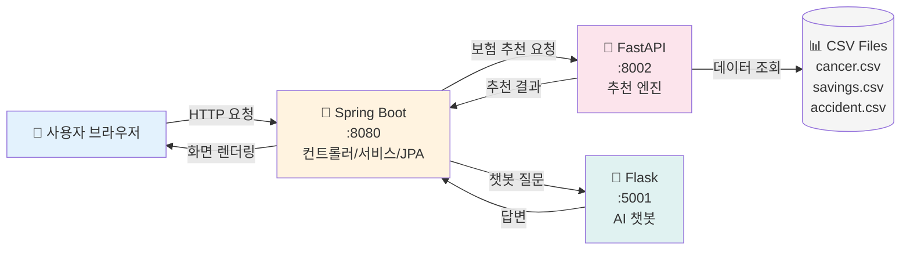
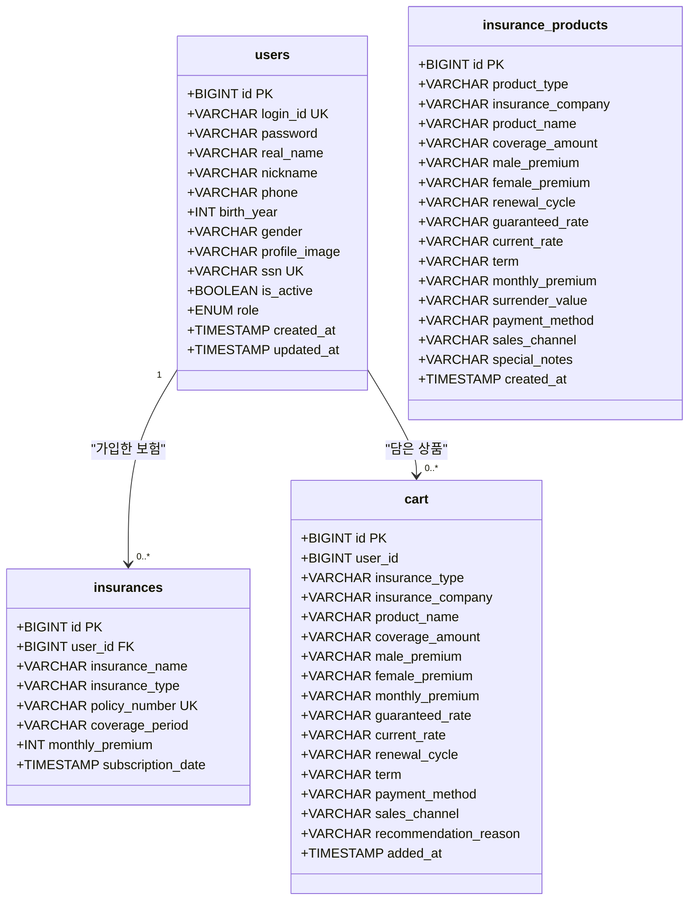
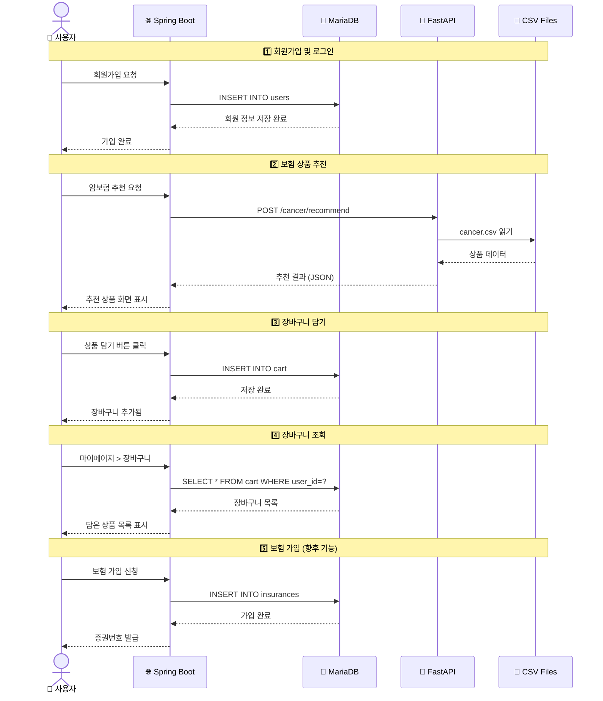
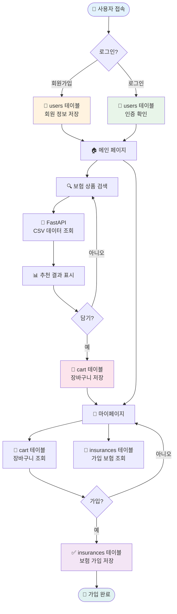
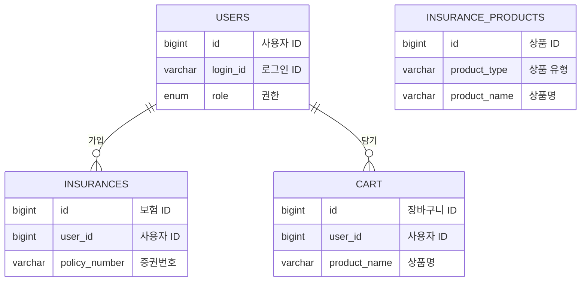

# 암보험 상품 추천 API

효율성 중심의 암보험 상품 추천 시스템

## 🏗️ 시스템 흐름도



## API 명세서

### Spring Boot API (Port 8080)

<table>
<thead>
<tr>
<th width="15%">기능</th>
<th width="10%">메소드</th>
<th width="35%">엔드포인트</th>
<th width="30%">설명</th>
<th width="10%">인증</th>
</tr>
</thead>
<tbody>
<tr style="background-color: #e3f2fd;">
<td colspan="5"><strong>사용자</strong></td>
</tr>
<tr>
<td>사용자 정보</td>
<td><code>GET</code></td>
<td><code>/api/user/current</code></td>
<td>현재 로그인 사용자 정보 조회</td>
<td>선택</td>
</tr>
<tr style="background-color: #fff3e0;">
<td colspan="5"><strong>관리자</strong></td>
</tr>
<tr>
<td>권한 변경</td>
<td><code>POST</code></td>
<td><code>/admin/users/{userId}/role</code></td>
<td>사용자 권한 변경</td>
<td><strong>ADMIN</strong></td>
</tr>
<tr>
<td>비활성화</td>
<td><code>POST</code></td>
<td><code>/admin/users/{userId}/withdraw</code></td>
<td>사용자 비활성화</td>
<td><strong>ADMIN</strong></td>
</tr>
<tr>
<td>활성화</td>
<td><code>POST</code></td>
<td><code>/admin/users/{userId}/restore</code></td>
<td>사용자 활성화</td>
<td><strong>ADMIN</strong></td>
</tr>
<tr>
<td>영구 삭제</td>
<td><code>DELETE</code></td>
<td><code>/admin/users/{userId}</code></td>
<td>사용자 영구 삭제</td>
<td><strong>ADMIN</strong></td>
</tr>
<tr>
<td>상품 삭제</td>
<td><code>DELETE</code></td>
<td><code>/admin/products/{productId}</code></td>
<td>보험 상품 삭제</td>
<td><strong>ADMIN</strong></td>
</tr>
<tr style="background-color: #fce4ec;">
<td colspan="5"><strong>보험 추천</strong></td>
</tr>
<tr>
<td>상해보험</td>
<td><code>POST</code></td>
<td><code>/accident/recommend/api</code></td>
<td>상해보험 추천</td>
<td>없음</td>
</tr>
<tr>
<td>암보험 (필터)</td>
<td><code>POST</code></td>
<td><code>/cancer/recommend/api</code></td>
<td>암보험 추천 (필터 기반)</td>
<td>없음</td>
</tr>
<tr>
<td>암보험 (프로필)</td>
<td><code>POST</code></td>
<td><code>/cancer/profile-recommend/api</code></td>
<td>암보험 추천 (프로필 기반)</td>
<td>없음</td>
</tr>
<tr>
<td>저축성보험</td>
<td><code>POST</code></td>
<td><code>/savings-insurance/recommend/api</code></td>
<td>저축성보험 추천</td>
<td>없음</td>
</tr>
<tr>
<td>연금보험</td>
<td><code>POST</code></td>
<td><code>/savings/recommend/api</code></td>
<td>연금보험 추천</td>
<td>없음</td>
</tr>
<tr>
<td>종신/정기보험</td>
<td><code>POST</code></td>
<td><code>/life/recommend</code></td>
<td>종신/정기보험 추천</td>
<td>없음</td>
</tr>
<tr style="background-color: #e8f5e9;">
<td colspan="5"><strong>관심 상품 (장바구니)</strong></td>
</tr>
<tr>
<td>상품 추가</td>
<td><code>POST</code></td>
<td><code>/cart/add</code></td>
<td>관심 상품 추가</td>
<td><strong>필수</strong></td>
</tr>
<tr>
<td>상품 삭제</td>
<td><code>DELETE</code></td>
<td><code>/cart/{cartId}</code></td>
<td>관심 상품 삭제</td>
<td><strong>필수</strong></td>
</tr>
<tr>
<td>전체 삭제</td>
<td><code>DELETE</code></td>
<td><code>/cart/clear</code></td>
<td>관심 상품 전체 삭제</td>
<td><strong>필수</strong></td>
</tr>
<tr>
<td>개수 조회</td>
<td><code>GET</code></td>
<td><code>/cart/count</code></td>
<td>관심 상품 개수 조회</td>
<td><strong>필수</strong></td>
</tr>
<tr style="background-color: #f3e5f5;">
<td colspan="5"><strong>유틸리티</strong></td>
</tr>
<tr>
<td>보험료 계산</td>
<td><code>POST</code></td>
<td><code>/api/calculate</code></td>
<td>보험료 계산</td>
<td>없음</td>
</tr>
<tr>
<td>챗봇 문의</td>
<td><code>POST</code></td>
<td><code>/chatbot/ask</code></td>
<td>챗봇 문의</td>
<td>없음</td>
</tr>
</tbody>
</table>

---

### FastAPI 추천 엔진 (Port 8002)

<table>
<thead>
<tr>
<th width="15%">기능</th>
<th width="10%">메소드</th>
<th width="35%">엔드포인트</th>
<th width="30%">설명</th>
<th width="10%">관련 엔진</th>
</tr>
</thead>
<tbody>
<tr style="background-color: #fce4ec;">
<td colspan="5"><strong>암보험</strong></td>
</tr>
<tr>
<td>필터 추천</td>
<td><code>POST</code></td>
<td><code>/recommend</code></td>
<td>필터 기반 암보험 추천</td>
<td><code>cancer_engine</code></td>
</tr>
<tr>
<td>프로필 추천</td>
<td><code>POST</code></td>
<td><code>/recommend/user-profile</code></td>
<td>사용자 프로필 기반 추천</td>
<td><code>cancer_engine</code></td>
</tr>
<tr>
<td>통계 조회</td>
<td><code>GET</code></td>
<td><code>/analytics/summary</code></td>
<td>암보험 상품 통계 조회</td>
<td><code>data_loader</code></td>
</tr>
<tr style="background-color: #e1f5fe;">
<td colspan="5"><strong>연금보험</strong></td>
</tr>
<tr>
<td>상품 추천</td>
<td><code>POST</code></td>
<td><code>/savings/recommend</code></td>
<td>연금보험 상품 추천</td>
<td><code>pension_engine</code></td>
</tr>
<tr>
<td>통계 조회</td>
<td><code>GET</code></td>
<td><code>/savings/analytics</code></td>
<td>연금보험 상품 통계 조회</td>
<td><code>pension_engine</code></td>
</tr>
<tr style="background-color: #fff3e0;">
<td colspan="5"><strong>저축성보험</strong></td>
</tr>
<tr>
<td>상품 추천</td>
<td><code>POST</code></td>
<td><code>/recommend/savings-insurance</code></td>
<td>저축성보험 상품 추천</td>
<td><code>savings_engine</code></td>
</tr>
<tr>
<td>통계 조회</td>
<td><code>GET</code></td>
<td><code>/savings-insurance/analytics</code></td>
<td>저축성보험 상품 통계 조회</td>
<td><code>savings_engine</code></td>
</tr>
<tr style="background-color: #e8f5e9;">
<td colspan="5"><strong>상해보험</strong></td>
</tr>
<tr>
<td>상품 추천</td>
<td><code>POST</code></td>
<td><code>/recommend/accident</code></td>
<td>상해보험 상품 추천</td>
<td><code>main.py</code></td>
</tr>
<tr style="background-color: #f3e5f5;">
<td colspan="5"><strong>관리/상태</strong></td>
</tr>
<tr>
<td>데이터 새로고침</td>
<td><code>POST</code></td>
<td><code>/admin/reload-data</code></td>
<td>데이터 및 추천 엔진 리로드</td>
<td><code>main.py</code></td>
</tr>
<tr>
<td>헬스 체크</td>
<td><code>GET</code></td>
<td><code>/health</code></td>
<td>API 서버 상태 확인</td>
<td><code>main.py</code></td>
</tr>
</tbody>
</table>

---

### Flask AI 챗봇 (Port 5001)

<table>
<thead>
<tr>
<th width="15%">기능</th>
<th width="10%">메소드</th>
<th width="35%">엔드포인트</th>
<th width="30%">설명</th>
<th width="10%">관련 엔진</th>
</tr>
</thead>
<tbody>
<tr style="background-color: #e0f2f1;">
<td colspan="5"><strong>챗봇</strong></td>
</tr>
<tr>
<td>질의응답</td>
<td><code>POST</code></td>
<td><code>/chat</code></td>
<td>질문에 대한 답변 반환 (딥러닝)</td>
<td><code>main.py</code></td>
</tr>
</tbody>
</table>

---

## 📊 데이터베이스 테이블 정의서

### 📐 전체 스키마 다이어그램



---

### 테이블 상세 정의

<table>
<tr>
<td width="50%" valign="top">

#### **users** - 사용자

<table>
<thead>
<tr>
<th align="left">컬럼명</th>
<th align="left">타입</th>
<th align="left">제약조건</th>
<th align="left">설명</th>
</tr>
</thead>
<tbody>
<tr style="background-color: #f0f8ff;">
<td colspan="4"><strong>핵심 컬럼</strong></td>
</tr>
<tr>
<td><code>id</code></td>
<td>BIGINT</td>
<td><strong>PK</strong></td>
<td>사용자 ID</td>
</tr>
<tr>
<td><code>login_id</code></td>
<td>VARCHAR</td>
<td><strong>UNIQUE</strong></td>
<td>로그인 아이디</td>
</tr>
<tr>
<td><code>password</code></td>
<td>VARCHAR</td>
<td>NOT NULL</td>
<td>비밀번호 (암호화)</td>
</tr>
<tr>
<td><code>real_name</code></td>
<td>VARCHAR</td>
<td>NOT NULL</td>
<td>실명</td>
</tr>
<tr style="background-color: #f0f8ff;">
<td colspan="4"><strong>프로필 정보</strong></td>
</tr>
<tr>
<td><code>nickname</code></td>
<td>VARCHAR</td>
<td>NULL</td>
<td>닉네임</td>
</tr>
<tr>
<td><code>phone</code></td>
<td>VARCHAR</td>
<td>NULL</td>
<td>전화번호</td>
</tr>
<tr>
<td><code>birth_year</code></td>
<td>INT</td>
<td>NULL</td>
<td>생년</td>
</tr>
<tr>
<td><code>gender</code></td>
<td>VARCHAR</td>
<td>NULL</td>
<td>성별</td>
</tr>
<tr>
<td><code>profile_image</code></td>
<td>VARCHAR</td>
<td>NULL</td>
<td>프로필 이미지</td>
</tr>
<tr>
<td><code>ssn</code></td>
<td>VARCHAR</td>
<td>UNIQUE</td>
<td>주민번호 (암호화)</td>
</tr>
<tr style="background-color: #f0f8ff;">
<td colspan="4"><strong>시스템 컬럼</strong></td>
</tr>
<tr>
<td><code>is_active</code></td>
<td>BOOLEAN</td>
<td>DEFAULT TRUE</td>
<td>활성화 여부</td>
</tr>
<tr>
<td><code>role</code></td>
<td>ENUM</td>
<td>DEFAULT USER</td>
<td>권한 (USER/ADMIN)</td>
</tr>
<tr>
<td><code>created_at</code></td>
<td>TIMESTAMP</td>
<td>NOT NULL</td>
<td>생성일시</td>
</tr>
<tr>
<td><code>updated_at</code></td>
<td>TIMESTAMP</td>
<td>NOT NULL</td>
<td>수정일시</td>
</tr>
</tbody>
</table>

**관계**: insurances (1:N), cart (1:N)  
**인덱스**: PK(id), UNIQUE(login_id, ssn)

</td>
<td width="50%" valign="top">

#### **insurances** - 가입 보험

<table>
<thead>
<tr>
<th align="left">컬럼명</th>
<th align="left">타입</th>
<th align="left">제약조건</th>
<th align="left">설명</th>
</tr>
</thead>
<tbody>
<tr>
<td><code>id</code></td>
<td>BIGINT</td>
<td><strong>PK</strong></td>
<td>보험 ID</td>
</tr>
<tr>
<td><code>user_id</code></td>
<td>BIGINT</td>
<td><strong>FK</strong> → users</td>
<td>사용자 ID</td>
</tr>
<tr>
<td><code>insurance_name</code></td>
<td>VARCHAR</td>
<td>NOT NULL</td>
<td>보험 상품명</td>
</tr>
<tr>
<td><code>insurance_type</code></td>
<td>VARCHAR</td>
<td>NULL</td>
<td>보험 유형</td>
</tr>
<tr>
<td><code>policy_number</code></td>
<td>VARCHAR</td>
<td><strong>UNIQUE</strong></td>
<td>증권번호</td>
</tr>
<tr>
<td><code>coverage_period</code></td>
<td>VARCHAR</td>
<td>NOT NULL</td>
<td>보장기간</td>
</tr>
<tr>
<td><code>monthly_premium</code></td>
<td>INT</td>
<td>NOT NULL</td>
<td>월 납입액</td>
</tr>
<tr>
<td><code>subscription_date</code></td>
<td>TIMESTAMP</td>
<td>NOT NULL</td>
<td>가입일</td>
</tr>
</tbody>
</table>

**관계**: ManyToOne → users.id (LAZY)  
**인덱스**: PK(id), UNIQUE(policy_number), FK(user_id)

<br>

#### **cart** - 장바구니

<table>
<thead>
<tr>
<th align="left">컬럼명</th>
<th align="left">타입</th>
<th align="left">제약조건</th>
<th align="left">설명</th>
</tr>
</thead>
<tbody>
<tr style="background-color: #f0f8ff;">
<td colspan="4"><strong>기본 정보</strong></td>
</tr>
<tr>
<td><code>id</code></td>
<td>BIGINT</td>
<td><strong>PK</strong></td>
<td>장바구니 ID</td>
</tr>
<tr>
<td><code>user_id</code></td>
<td>BIGINT</td>
<td>NOT NULL</td>
<td>사용자 ID</td>
</tr>
<tr>
<td><code>insurance_type</code></td>
<td>VARCHAR</td>
<td>NOT NULL</td>
<td>보험 유형</td>
</tr>
<tr>
<td><code>product_name</code></td>
<td>VARCHAR</td>
<td>NOT NULL</td>
<td>상품명</td>
</tr>
<tr style="background-color: #f0f8ff;">
<td colspan="4"><strong>상품 상세 정보</strong></td>
</tr>
<tr>
<td><code>coverage_amount</code></td>
<td>VARCHAR</td>
<td>NULL</td>
<td>보장금액</td>
</tr>
<tr>
<td><code>monthly_premium</code></td>
<td>VARCHAR</td>
<td>NULL</td>
<td>월 납입금</td>
</tr>
<tr>
<td><code>recommendation_reason</code></td>
<td>VARCHAR(2000)</td>
<td>NULL</td>
<td>추천 이유</td>
</tr>
<tr>
<td><code>added_at</code></td>
<td>TIMESTAMP</td>
<td>NOT NULL</td>
<td>담은 날짜</td>
</tr>
</tbody>
</table>

**인덱스**: PK(id), INDEX(user_id, insurance_type)

</td>
</tr>
</table>

<details>
<summary><strong>insurance_products</strong> - 보험 상품 카탈로그 (펼치기)</summary>

<table>
<thead>
<tr>
<th align="left">컬럼명</th>
<th align="left">타입</th>
<th align="left">제약조건</th>
<th align="left">설명</th>
</tr>
</thead>
<tbody>
<tr style="background-color: #f0f8ff;">
<td colspan="4"><strong>기본 정보</strong></td>
</tr>
<tr>
<td><code>id</code></td>
<td>BIGINT</td>
<td><strong>PK</strong></td>
<td>상품 ID</td>
</tr>
<tr>
<td><code>product_type</code></td>
<td>VARCHAR</td>
<td>NOT NULL</td>
<td>상품 유형 (암보험/상해보험/저축성보험)</td>
</tr>
<tr>
<td><code>insurance_company</code></td>
<td>VARCHAR</td>
<td>NOT NULL</td>
<td>보험회사명</td>
</tr>
<tr>
<td><code>product_name</code></td>
<td>VARCHAR</td>
<td>NOT NULL</td>
<td>상품명</td>
</tr>
<tr style="background-color: #f0f8ff;">
<td colspan="4"><strong>보장/보험료 정보</strong></td>
</tr>
<tr>
<td><code>coverage_amount</code></td>
<td>VARCHAR</td>
<td>NULL</td>
<td>보장금액</td>
</tr>
<tr>
<td><code>male_premium</code></td>
<td>VARCHAR</td>
<td>NULL</td>
<td>남성 보험료</td>
</tr>
<tr>
<td><code>female_premium</code></td>
<td>VARCHAR</td>
<td>NULL</td>
<td>여성 보험료</td>
</tr>
<tr>
<td><code>monthly_premium</code></td>
<td>VARCHAR</td>
<td>NULL</td>
<td>월 납입금</td>
</tr>
<tr>
<td><code>renewal_cycle</code></td>
<td>VARCHAR</td>
<td>NULL</td>
<td>갱신주기</td>
</tr>
<tr style="background-color: #f0f8ff;">
<td colspan="4"><strong>저축성 보험 정보</strong></td>
</tr>
<tr>
<td><code>guaranteed_rate</code></td>
<td>VARCHAR</td>
<td>NULL</td>
<td>최저보증이율</td>
</tr>
<tr>
<td><code>current_rate</code></td>
<td>VARCHAR</td>
<td>NULL</td>
<td>현재공시이율</td>
</tr>
<tr>
<td><code>surrender_value</code></td>
<td>VARCHAR</td>
<td>NULL</td>
<td>해약환급금</td>
</tr>
<tr style="background-color: #f0f8ff;">
<td colspan="4"><strong>기타</strong></td>
</tr>
<tr>
<td><code>term</code></td>
<td>VARCHAR</td>
<td>NULL</td>
<td>보험기간</td>
</tr>
<tr>
<td><code>payment_method</code></td>
<td>VARCHAR</td>
<td>NULL</td>
<td>납입방법</td>
</tr>
<tr>
<td><code>sales_channel</code></td>
<td>VARCHAR</td>
<td>NULL</td>
<td>판매채널</td>
</tr>
<tr>
<td><code>special_notes</code></td>
<td>VARCHAR(2000)</td>
<td>NULL</td>
<td>특이사항</td>
</tr>
<tr>
<td><code>created_at</code></td>
<td>TIMESTAMP</td>
<td>NOT NULL</td>
<td>등록일시</td>
</tr>
</tbody>
</table>

**인덱스**: PK(id), INDEX(product_type, insurance_company)

</details>

---

### 데이터 흐름도 (사용자 시나리오)



### 테이블 사용 흐름



**테이블 사용 흐름 요약:**

1. 🔐 **users**: 회원가입/로그인 시 생성 및 조회
2. 🛒 **cart**: 추천받은 상품을 담을 때 INSERT, 마이페이지에서 SELECT
3. 📄 **insurances**: 실제 보험 가입 시 INSERT (현재 미구현)
4. 📦 **insurance_products**: DB에 직접 상품 등록 시 사용 (관리자 기능)

---

### 테이블 관계도



---

## 🎯 추천 규칙

### 1. 필수 조건 (Filter 단계)

가입 가능성 보장을 위한 필수 필터링:

- **나이 범위**: `min_age ≤ 사용자 나이 ≤ max_age`
- **보장금액 범위**: `min_coverage ≤ coverage_amount ≤ max_coverage`
- **상품 판매 상태**: `sales_date` (현재 판매 중인 상품만)
- **제외 조건**: `special_notes` (특정 질환자 제외 등)

→ 이 조건을 통과하지 못한 상품은 자동 제외

### 2. 효율성 지표 (Ranking 단계)

남은 상품을 점수화하여 우선순위 부여:

#### 보장금액 점수 (Coverage Score)

- 일반암 진단비(`coverage_name`에 "일반암") 기준
- `payment_amount`가 클수록 높은 점수

#### 보험료 대비 효율성 (Value Score)

- **공식**: `보장금액 ÷ 월 보험료`
- 같은 보장이라면 보험료가 저렴할수록 유리

#### 상품 안정성 (Stability Score)

- 해약환급금(`surrender_value`)이 높을수록 점수 ↑
- 갱신주기(`renewal_cycle`)가 길수록 점수 ↑ (갱신형 < 종신형/정기형)

### 3. 최종 추천 점수

```
최종점수 = (Coverage Score × 0.5)
         + (Value Score × 0.3)
         + (Stability Score × 0.2)
```

## 🚀 빠른 시작

### 설치 및 실행

```bash
# 의존성 설치
pip install -r requirements.txt

# 서버 실행
python run_server.py
```

서버: `http://localhost:8001`

### API 사용

```http
POST http://localhost:8001/recommend
Content-Type: application/json

{
    "min_coverage": 30000000,
    "max_premium_avg": 50000,
    "prefer_non_renewal": true,
    "coverage_weight": 0.5,
    "value_weight": 0.3,
    "stability_weight": 0.2,
    "top_n": 10
}
```

## 📁 핵심 파일

- `app/main.py` - FastAPI 서버
- `app/recommendation_engine.py` - 추천 알고리즘
- `app/data_loader.py` - 데이터 처리
- `products/` - 암보험 상품 데이터 (CSV)
- `requirements.txt` - Python 의존성

## 💡 핵심 특징

- **가입 불가 상품 자동 제외**: 필수 조건 미달 시 자동 필터링
- **효율성 우선**: 보험료 대비 보장금액이 높은 상품 우선 추천
- **실제 가입 가능성**: 사용자가 실제 가입할 확률이 높은 상품 상위 노출
