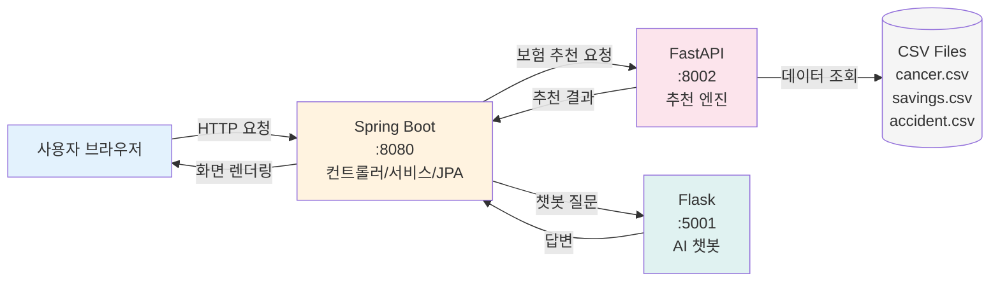
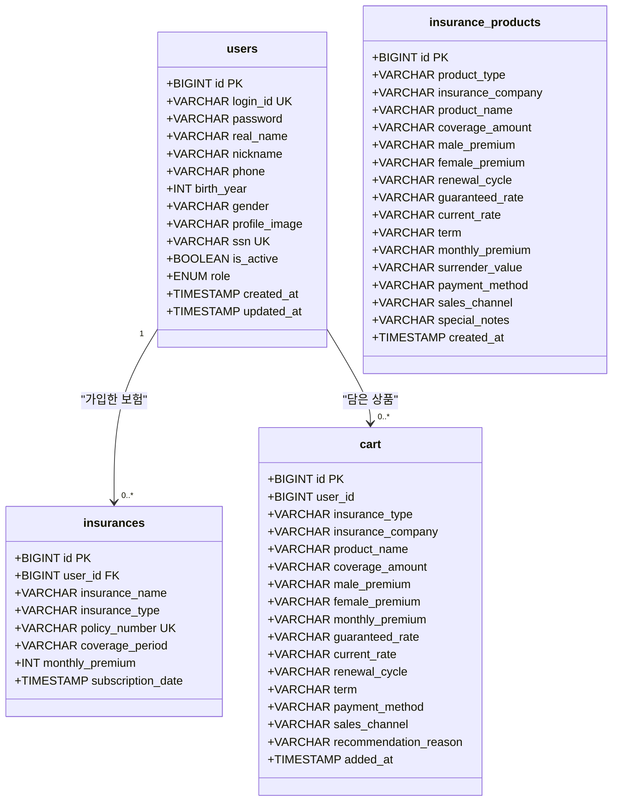

# 암보험 상품 추천 API

효율성 중심의 암보험 상품 추천 시스템

## 시스템 흐름도

## API 명세서

### Spring Boot API (Port 8080)

<table>
<thead>
<tr>
<th width="15%">기능</th>
<th width="10%">메소드</th>
<th width="35%">엔드포인트</th>
<th width="30%">설명</th>
<th width="10%">인증</th>
</tr>
</thead>
<tbody>
<tr style="background-color: #e3f2fd;">
<td colspan="5"><strong>사용자</strong></td>
</tr>
<tr>
<td>사용자 정보</td>
<td><code>GET</code></td>
<td><code>/api/user/current</code></td>
<td>현재 로그인 사용자 정보 조회</td>
<td>선택</td>
</tr>
<tr style="background-color: #fff3e0;">
<td colspan="5"><strong>관리자</strong></td>
</tr>
<tr>
<td>권한 변경</td>
<td><code>POST</code></td>
<td><code>/admin/users/{userId}/role</code></td>
<td>사용자 권한 변경</td>
<td><strong>ADMIN</strong></td>
</tr>
<tr>
<td>비활성화</td>
<td><code>POST</code></td>
<td><code>/admin/users/{userId}/withdraw</code></td>
<td>사용자 비활성화</td>
<td><strong>ADMIN</strong></td>
</tr>
<tr>
<td>활성화</td>
<td><code>POST</code></td>
<td><code>/admin/users/{userId}/restore</code></td>
<td>사용자 활성화</td>
<td><strong>ADMIN</strong></td>
</tr>
<tr>
<td>영구 삭제</td>
<td><code>DELETE</code></td>
<td><code>/admin/users/{userId}</code></td>
<td>사용자 영구 삭제</td>
<td><strong>ADMIN</strong></td>
</tr>
<tr>
<td>상품 삭제</td>
<td><code>DELETE</code></td>
<td><code>/admin/products/{productId}</code></td>
<td>보험 상품 삭제</td>
<td><strong>ADMIN</strong></td>
</tr>
<tr style="background-color: #fce4ec;">
<td colspan="5"><strong>보험 추천</strong></td>
</tr>
<tr>
<td>상해보험</td>
<td><code>POST</code></td>
<td><code>/accident/recommend/api</code></td>
<td>상해보험 추천</td>
<td>없음</td>
</tr>
<tr>
<td>암보험 (필터)</td>
<td><code>POST</code></td>
<td><code>/cancer/recommend/api</code></td>
<td>암보험 추천 (필터 기반)</td>
<td>없음</td>
</tr>
<tr>
<td>암보험 (프로필)</td>
<td><code>POST</code></td>
<td><code>/cancer/profile-recommend/api</code></td>
<td>암보험 추천 (프로필 기반)</td>
<td>없음</td>
</tr>
<tr>
<td>저축성보험</td>
<td><code>POST</code></td>
<td><code>/savings-insurance/recommend/api</code></td>
<td>저축성보험 추천</td>
<td>없음</td>
</tr>
<tr>
<td>연금보험</td>
<td><code>POST</code></td>
<td><code>/savings/recommend/api</code></td>
<td>연금보험 추천</td>
<td>없음</td>
</tr>
<tr>
<td>종신/정기보험</td>
<td><code>POST</code></td>
<td><code>/life/recommend</code></td>
<td>종신/정기보험 추천</td>
<td>없음</td>
</tr>
<tr style="background-color: #e8f5e9;">
<td colspan="5"><strong>관심 상품 (장바구니)</strong></td>
</tr>
<tr>
<td>상품 추가</td>
<td><code>POST</code></td>
<td><code>/cart/add</code></td>
<td>관심 상품 추가</td>
<td><strong>필수</strong></td>
</tr>
<tr>
<td>상품 삭제</td>
<td><code>DELETE</code></td>
<td><code>/cart/{cartId}</code></td>
<td>관심 상품 삭제</td>
<td><strong>필수</strong></td>
</tr>
<tr>
<td>전체 삭제</td>
<td><code>DELETE</code></td>
<td><code>/cart/clear</code></td>
<td>관심 상품 전체 삭제</td>
<td><strong>필수</strong></td>
</tr>
<tr>
<td>개수 조회</td>
<td><code>GET</code></td>
<td><code>/cart/count</code></td>
<td>관심 상품 개수 조회</td>
<td><strong>필수</strong></td>
</tr>
<tr style="background-color: #f3e5f5;">
<td colspan="5"><strong>유틸리티</strong></td>
</tr>
<tr>
<td>보험료 계산</td>
<td><code>POST</code></td>
<td><code>/api/calculate</code></td>
<td>보험료 계산</td>
<td>없음</td>
</tr>
<tr>
<td>챗봇 문의</td>
<td><code>POST</code></td>
<td><code>/chatbot/ask</code></td>
<td>챗봇 문의</td>
<td>없음</td>
</tr>
</tbody>
</table>

---

### FastAPI 추천 엔진 (Port 8002)

<table>
<thead>
<tr>
<th width="15%">기능</th>
<th width="10%">메소드</th>
<th width="35%">엔드포인트</th>
<th width="30%">설명</th>
<th width="10%">관련 엔진</th>
</tr>
</thead>
<tbody>
<tr style="background-color: #fce4ec;">
<td colspan="5"><strong>암보험</strong></td>
</tr>
<tr>
<td>필터 추천</td>
<td><code>POST</code></td>
<td><code>/recommend</code></td>
<td>필터 기반 암보험 추천</td>
<td><code>cancer_engine</code></td>
</tr>
<tr>
<td>프로필 추천</td>
<td><code>POST</code></td>
<td><code>/recommend/user-profile</code></td>
<td>사용자 프로필 기반 추천</td>
<td><code>cancer_engine</code></td>
</tr>
<tr>
<td>통계 조회</td>
<td><code>GET</code></td>
<td><code>/analytics/summary</code></td>
<td>암보험 상품 통계 조회</td>
<td><code>data_loader</code></td>
</tr>
<tr style="background-color: #e1f5fe;">
<td colspan="5"><strong>연금보험</strong></td>
</tr>
<tr>
<td>상품 추천</td>
<td><code>POST</code></td>
<td><code>/savings/recommend</code></td>
<td>연금보험 상품 추천</td>
<td><code>pension_engine</code></td>
</tr>
<tr>
<td>통계 조회</td>
<td><code>GET</code></td>
<td><code>/savings/analytics</code></td>
<td>연금보험 상품 통계 조회</td>
<td><code>pension_engine</code></td>
</tr>
<tr style="background-color: #fff3e0;">
<td colspan="5"><strong>저축성보험</strong></td>
</tr>
<tr>
<td>상품 추천</td>
<td><code>POST</code></td>
<td><code>/recommend/savings-insurance</code></td>
<td>저축성보험 상품 추천</td>
<td><code>savings_engine</code></td>
</tr>
<tr>
<td>통계 조회</td>
<td><code>GET</code></td>
<td><code>/savings-insurance/analytics</code></td>
<td>저축성보험 상품 통계 조회</td>
<td><code>savings_engine</code></td>
</tr>
<tr style="background-color: #e8f5e9;">
<td colspan="5"><strong>상해보험</strong></td>
</tr>
<tr>
<td>상품 추천</td>
<td><code>POST</code></td>
<td><code>/recommend/accident</code></td>
<td>상해보험 상품 추천</td>
<td><code>main.py</code></td>
</tr>
<tr style="background-color: #f3e5f5;">
<td colspan="5"><strong>관리/상태</strong></td>
</tr>
<tr>
<td>데이터 새로고침</td>
<td><code>POST</code></td>
<td><code>/admin/reload-data</code></td>
<td>데이터 및 추천 엔진 리로드</td>
<td><code>main.py</code></td>
</tr>
<tr>
<td>헬스 체크</td>
<td><code>GET</code></td>
<td><code>/health</code></td>
<td>API 서버 상태 확인</td>
<td><code>main.py</code></td>
</tr>
</tbody>
</table>

---

### Flask AI 챗봇 (Port 5001)

<table>
<thead>
<tr>
<th width="15%">기능</th>
<th width="10%">메소드</th>
<th width="35%">엔드포인트</th>
<th width="30%">설명</th>
<th width="10%">관련 엔진</th>
</tr>
</thead>
<tbody>
<tr style="background-color: #e0f2f1;">
<td colspan="5"><strong>챗봇</strong></td>
</tr>
<tr>
<td>질의응답</td>
<td><code>POST</code></td>
<td><code>/chat</code></td>
<td>질문에 대한 답변 반환 (딥러닝)</td>
<td><code>main.py</code></td>
</tr>
</tbody>
</table>

---

## 데이터베이스 테이블 정의서

### 전체 스키마 다이어그램

---

### 테이블 상세 정의

<table>
<tr>
<td width="50%" valign="top">

#### **users** - 사용자

<table>
<thead>
<tr>
<th align="left">컬럼명</th>
<th align="left">타입</th>
<th align="left">제약조건</th>
<th align="left">설명</th>
</tr>
</thead>
<tbody>
<tr style="background-color: #f0f8ff;">
<td colspan="4"><strong>핵심 컬럼</strong></td>
</tr>
<tr>
<td><code>id</code></td>
<td>BIGINT</td>
<td><strong>PK</strong></td>
<td>사용자 ID</td>
</tr>
<tr>
<td><code>login_id</code></td>
<td>VARCHAR</td>
<td><strong>UNIQUE</strong></td>
<td>로그인 아이디</td>
</tr>
<tr>
<td><code>password</code></td>
<td>VARCHAR</td>
<td>NOT NULL</td>
<td>비밀번호 (암호화)</td>
</tr>
<tr>
<td><code>real_name</code></td>
<td>VARCHAR</td>
<td>NOT NULL</td>
<td>실명</td>
</tr>
<tr style="background-color: #f0f8ff;">
<td colspan="4"><strong>프로필 정보</strong></td>
</tr>
<tr>
<td><code>nickname</code></td>
<td>VARCHAR</td>
<td>NULL</td>
<td>닉네임</td>
</tr>
<tr>
<td><code>phone</code></td>
<td>VARCHAR</td>
<td>NULL</td>
<td>
